# LFM2.5-2.6B Quantization Report

[LFM2.5-2.6B](https://www.liquid.ai/blog/lfm2-5-2-6b) is a new tiny model by
LiquidAI, with benchmarks that put it head to head with much larger models.

I've run llama-perplexity on many model GGUF quants, crossed with many KV cache quants,
to understand the model's best overall quantization for any given amount of memory.

In this document I also compare how different quantization metrics show (or hide) model
degradation.

## If you don't have time to read

- The model fits on an 8GB Raspberry Pi with no material degradation and on a 4GB
  Raspberry Pi with contained degradation.
- DO NOT use Q4_K_M.
- _On this model,_ model quant quality degrades faster than KV cache quant.
- Use `-hf LiquidAI/LFM2.5-2.6B-GGUF:Q8_0 --cache-type-k q8_0 --cache-type-v q8_0` (4.5
  GB VRAM; 6GB total). f16/bf16 gives no further quality boost.
- If you're short on memory, use `-hf bartowski/LiquidAI_LFM2.5-2.6B-GGUF:IQ4_XS
--cache-type-k q3_0 --cache-type-v q3_0 --kv-tail-tokens 512` with
  [BeeLlama](https://github.com/Anbeeld/beellama.cpp) v0.4.2 (2.6 GB VRAM; 3.4GB total).
  You're walking the edge of the quality cliff - do not push beyond this.
- Abliteration comes with a flat cost of ~0.075 KLD.
- Logarithmic KLD and Top-1% plots lie to you by telling you that quality degradation is
  smooth, while it's actually a cliff.

## Methodology

All runs and reports were generated with `pixi r perplexity` and `pixi r perplexity-report`.
The tool ran `llama-perplexity --ctx-size 32768 -f sample-data/wiki.test.head-2.4k.raw -fa on -ngl 99` on [BeeLlama](https://github.com/Anbeeld/beellama.cpp) v0.4.2, CUDA backend (compiled with `-DGGML_CUDA_FA_ALL_QUANTS=ON`) on an RTX 3080.
This parsed 2,400 lines of wikitext over a 32k context, which resulted in 5 measurements per run.

I compared these quantizations of [LFM2.5-2.6B](https://huggingface.co/LiquidAI/LFM2.5-2.6B):

- [LiquidAI/LFM2.5-2.6B-GGUF](https://huggingface.co/LiquidAI/LFM2.5-2.6B-GGUF)
- [bartowski/LiquidAI_LFM2.5-2.6B-GGUF](https://huggingface.co/bartowski/LiquidAI_LFM2.5-2.6B-GGUF)
- [mradermacher/LFM2.5-2.6B-GGUF](https://huggingface.co/mradermacher/LFM2.5-2.6B-GGUF)
- [noctrex/LFM2.5-2.6B-heretic-uncensored-GGUF](https://huggingface.co/noctrex/LFM2.5-2.6B-heretic-uncensored-GGUF)

across several K/V cache quantizations:

| Label | Parameters | Notes |
| --- | --- | --- |
| f16       | `--cache-type-k f16 --cache-type-v f16` | |
| q8_0      | `--cache-type-k q8_0 --cache-type-v q8_0` | |
| q8_0/q6_0 | `--cache-type-k q8_0 --cache-type-v q6_0` | BeeLlama only |
| q8_0/q5_1 | `--cache-type-k q8_0 --cache-type-v q5_1` | |
| q5_0      | `--cache-type-k q5_0 --cache-type-v q5_0` | |
| q5_0 t512 | `--cache-type-k q5_0 --cache-type-v q5_0 --kv-tail-tokens 512` | BeeLlama only |
| q5_0 t1024 | `--cache-type-k q5_0 --cache-type-v q5_0 --kv-tail-tokens 1024` | BeeLlama only |
| q4_0      | `--cache-type-k q4_0 --cache-type-v q4_0` | |
| q4_0 t512 | `--cache-type-k q4_0 --cache-type-v q4_0 --kv-tail-tokens 512` | BeeLlama only |
| q4_0 t1024 | `--cache-type-k q4_0 --cache-type-v q4_0 --kv-tail-tokens 1024` | BeeLlama only |
| q4_0 t2048 | `--cache-type-k q4_0 --cache-type-v q4_0 --kv-tail-tokens 2048` | BeeLlama only |
| q3_0      | `--cache-type-k q3_0 --cache-type-v q3_0` | BeeLlama only |
| q3_0 t512 | `--cache-type-k q3_0 --cache-type-v q3_0 --kv-tail-tokens 512` | BeeLlama only |
| q3_0 t1024 | `--cache-type-k q3_0 --cache-type-v q3_0 --kv-tail-tokens 1024` | BeeLlama only |
| q3_0 t2048 | `--cache-type-k q3_0 --cache-type-v q3_0 --kv-tail-tokens 2048` | BeeLlama only |
| q2_0      | `--cache-type-k q2_0 --cache-type-v q2_0` | BeeLlama only |
| q2_0 t512 | `--cache-type-k q2_0 --cache-type-v q2_0 --kv-tail-tokens 512` | BeeLlama only |
| q2_0 t1024 | `--cache-type-k q2_0 --cache-type-v q2_0 --kv-tail-tokens 1024` | BeeLlama only |
| q2_0 t2048 | `--cache-type-k q2_0 --cache-type-v q2_0 --kv-tail-tokens 2048` | BeeLlama only |

**Note:** due to its geometry, the LFM family is incompatible with KVarN cache quantization.

After measuring, I rescaled the context window to 128k and calculated the total VRAM
usage (model + context).

**Note:** the headline figures in the top paragraph are actual llamacpp measures (`top` +
`nvidia-smi`); they are larger because they add scratch buffers and the llamacpp
executable.

All plots display two lines:

- **Solid line:** Absolute best mean KLD for the total size in RAM (quantized model + quantized cache)
- **Dotted line:** Best mean KLD for the model size, with unquantized cache

### Defects in the methodology

Context size was measured at 32k and then extrapolated to 128k before plotting. This
rescaling was necessary to keep the test runtime short and the logits file small. This
may cause a small distortion when `--kv-tail-tokens` is enabled. It's worth noting
however that, in the worst case, the 2k tail is still << 32k context.

Speed measures were taken with llama-perplexity and they should be used skeptically. Use
llama-bench or llama-benchy for better measures.

### A word on the measures

- Plotting KLD on a log Y axis (which is done very frequently) is a very bad idea
  because it gives the impression of quality degrading smoothly. It does not: beyond a
  certain point it drops off a cliff, but you cannot see it from the log plot. KLD on a
  linear Y axis gives a much more truthful view.
- 99% KLD shows a smoother slope than mean KLD, plus non-linearities on higher quants.
  Don't use it.
- Top 1% is not a good measure: it suggests a decrease in quality at very low quants
  where there is none (100% by definition at bf16 vs. 97.6% at Q8); at high quants it
  shows a smoothly declining slope, which hides the quality cliff.
- Among all perplexity measures, the only one that is worth keeping is `Cor(ln(PPL(Q)),
  ln(PPL(base)))`: it produces a very flat plot at high quant and a sharp cliff.
- _Same sampled token_, a.k.a. collision cross-entropy, is a custom measure (requires
  the [llamacpp patch](../same-sampled-token.patch)) inspired by [Quesma's excellent
  blog post](https://quesma.com/blog/qwen-quantization-quality/). It adds the collision
  probability `sum_i p_base(i) * p(i)` to `llama-perplexity --kl-divergence` and shows
  the sharpest cliff behaviour and (on Quesma's blog post) the most reliable prediction
  of actual benchmark output.

#### TL;DR what measures should I use in life?

- **If you can patch and recompile llamacpp:** Same sampled token
- **Otherwise:** Mean KLD with linear Y scale.
- If all you have is a plot with log scale, ask AI to regenerate it with a linear scale.
- **If you can't afford to create a logits file:** `Cor(ln(PPL(Q)), ln(PPL(base)))`

## Best quants

These model/KV cache quant combinations were cherry-picked as they sit immediately
before a cliff. This table is not exhaustive; for a very tight fit there are other
quants that are very close to them and on the frontier too; they have been hidden here
for the sake of readability but are available on the [Interactive HTML
report](https://htmlpreview.github.io/?https://raw.githubusercontent.com/crusaderky/pixi-llm-recipes/main/perplexity/LFM2.5-2.6B/report.html).

| Run | Weights (MiB) | KV cache (MiB) @128k | VRAM (MiB) @128k | Mean KLD | 99.9% KLD | Top-1 (%) | Same sampled (%) | Perplexity (%) | Speed (tok/s) | Speed (%) |
|---|---|---|---|---|---|---|---|---|---|---|
| LiquidAI:BF16\|f16 | 5,153 | 2,048 | 7,201 | 0.000000 | 0.000051 | 99.998 ± 0.002 | 53.758 ± 0.114 | 99.80 | 4769.7 | 100.0 |
| LiquidAI:Q8_0\|f16 | 2,742 | 2,048 | 4,790 | 0.003303 | 0.161592 | 97.608 ± 0.053 | 53.690 ± 0.114 | 99.76 | 5882.9 | 123.3 |
| LiquidAI:Q8_0\|q8_0 | 2,742 | 1,088 | 3,830 | 0.003696 | 0.174973 | 97.430 ± 0.055 | 53.662 ± 0.114 | 99.75 | 5820.2 | 122.0 |
| bartowski:Q6_K_L\|q8_0 | 2,194 | 1,088 | 3,282 | 0.011447 | 0.564217 | 95.428 ± 0.073 | 53.475 ± 0.114 | 99.65 | 5380.6 | 112.8 |
| bartowski:Q6_K\|q4_0 t512 | 2,133 | 608 | 2,741 | 0.018860 | 0.967857 | 94.257 ± 0.081 | 53.386 ± 0.114 | 99.55 | 4957.3 | 103.9 |
| bartowski:Q5_K_S\|q3_0 t512 | 1,812 | 480 | 2,292 | 0.075453 | 3.549587 | 88.627 ± 0.111 | 52.409 ± 0.115 | 98.71 | 5371.8 | 112.6 |
| bartowski:IQ4_XS\|q3_0 t512 | 1,452 | 480 | 1,932 | 0.189228 | 7.085299 | 82.178 ± 0.134 | 51.473 ± 0.117 | 97.01 | 5620.6 | 117.8 |

## Plots

Mean and 99% KLD, plotted on a log Y axis, give the impression of smoothly declining
quality starting from q8:

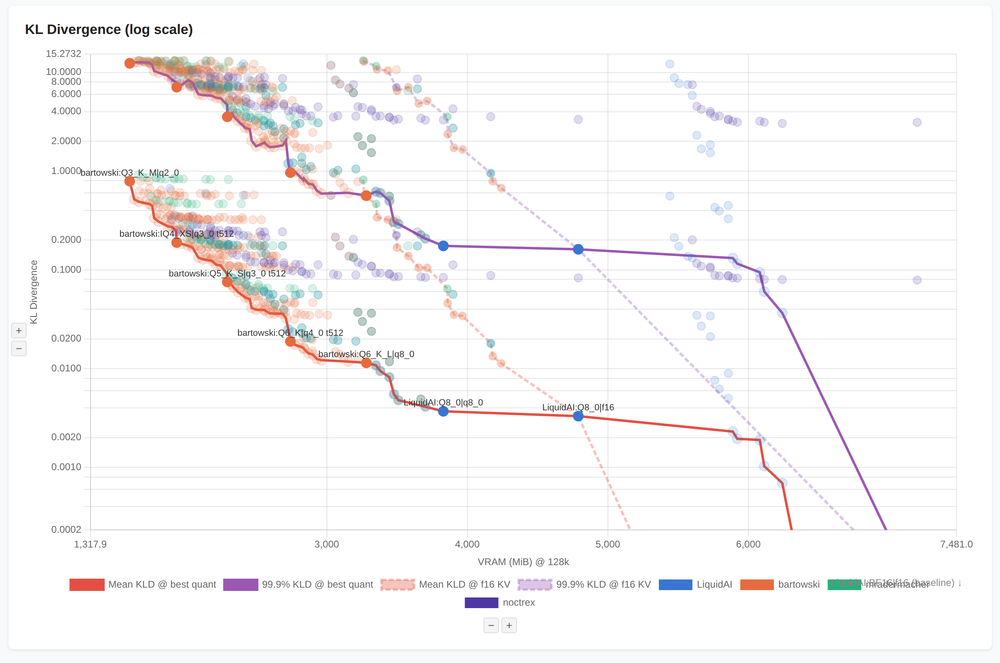

But once you switch to linear Y axis you realise there's a cliff:

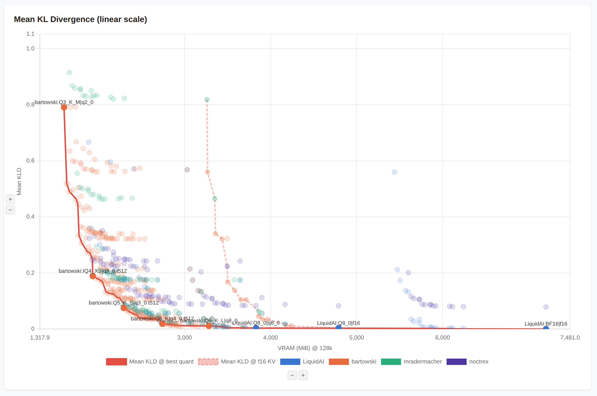

Same plot, zoomed in to cut out the obviously unusable quants, starts giving us insights:

- Q8_0/q8_0/q8_0 is practically lossless
- Q6_K/q4_0/q4_0 t512 is 1GB smaller and still very well behaved at 0.02 KLD.
  Q4_K_M/q8_0/q8_0 is vastly worse at 0.12 KLD. This contradicts Reddit folklore.
- Beyond that, you can push it up to IQ4_XS/q3_0/q3_0 t512 (KLD 0.19) and it's probably going to be still usable.

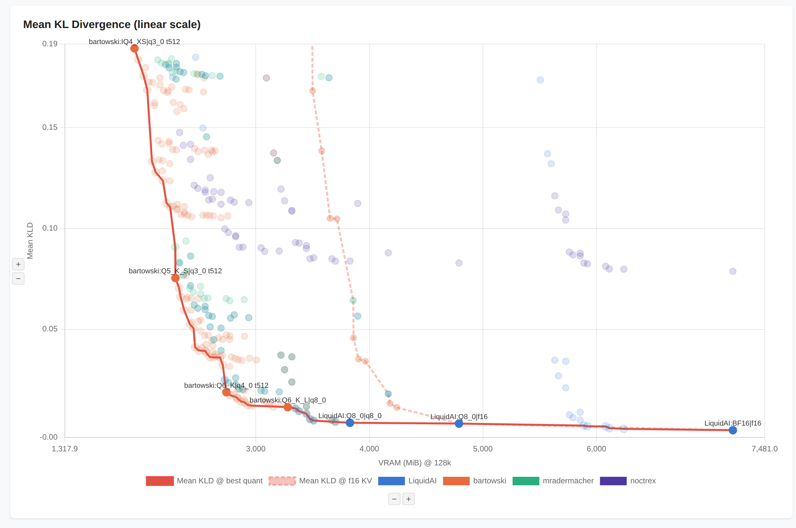

Q4_K_M is an abnormally bad quant for LiquidAI, mradermacher, and noctrex, showing
non-monotonic behaviour; it should be avoided. Bartowski's Q4_K_M is unaffected:

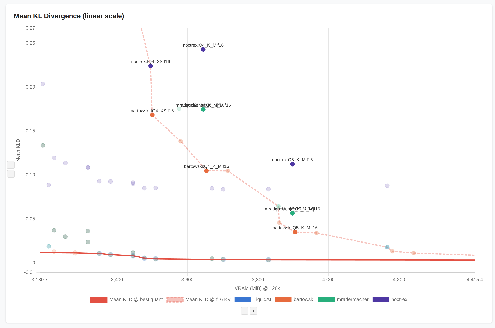

Noctrex's abliterated model comes with a flat cost of ~0.07 KLD:

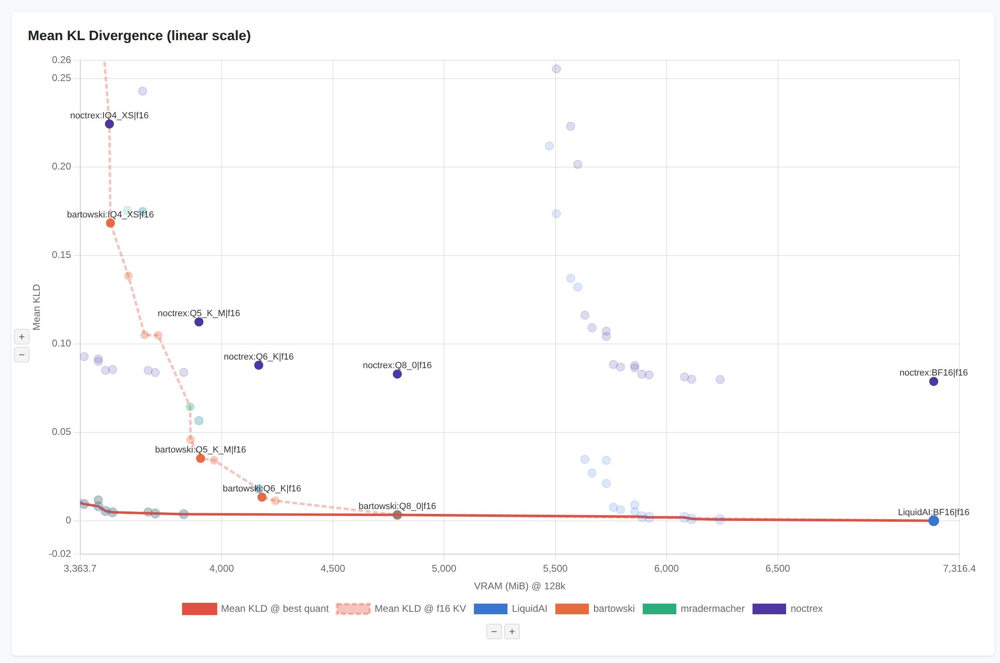

99% KLD (linear scale) shows a curve that degrades much less abruptly than mean KLD; it
also shows nonlinearity on high quants vs. the mean (the line still connects the best
mean KLD points), where some quants show a spike in 99% KLD while being optimal on the
mean measure.

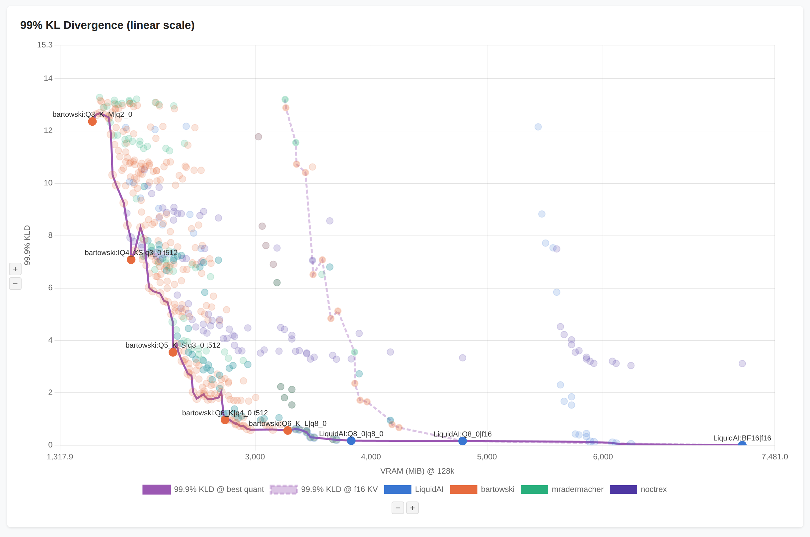

Top 1% is not a good measure: it suggests a decrease in quality at very low quants where
there is none (100% by definition at bf16 vs. 97.6% at Q8); at high quants it shows a
smoothly declining slope, which hides the quality cliff.

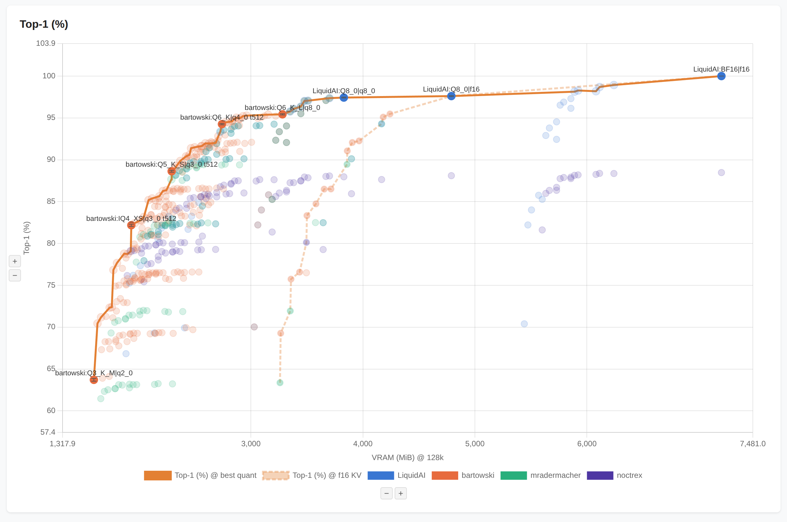

The perplexity measure `Cor(ln(PPL(Q)), ln(PPL(base)))` produces a very flat plot at low
quants and a sharp cliff, matching closing the shape of the Mean KLD. Note that this is
NOT the absolute, delta, or relative perplexity which is frequently shown online.

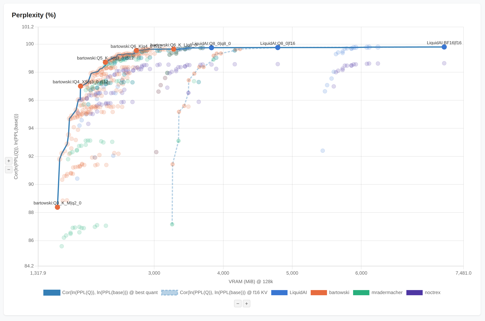

Same sampled token, a.k.a. collision cross-entropy, is a custom measure (requires the
[llamacpp patch](../same-sampled-token.patch)) inspired by [Quesma's excellent blog
post](https://quesma.com/blog/qwen-quantization-quality/). It shows the sharpest cliff
behaviour and (on Quesma's blog post) the most reliable prediction of actual benchmark
output.

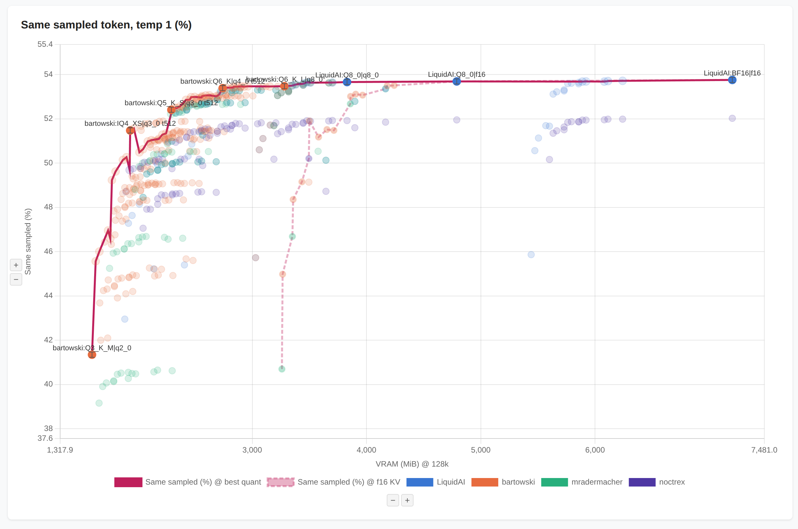

Same as above, zoomed in:

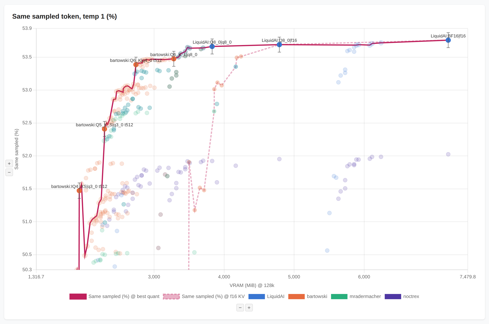

Speed degrades by 20% at high quants. Note that this plot was generated with
llama-perplexity and is specific to the current CUDA kernels as of BeeLlama 0.4.2. You
should retest on your own hardware.

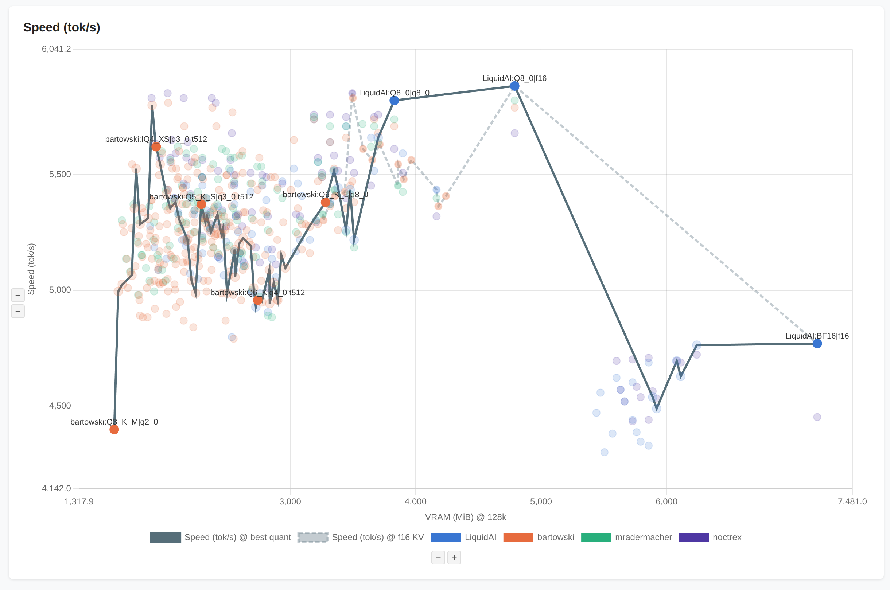

