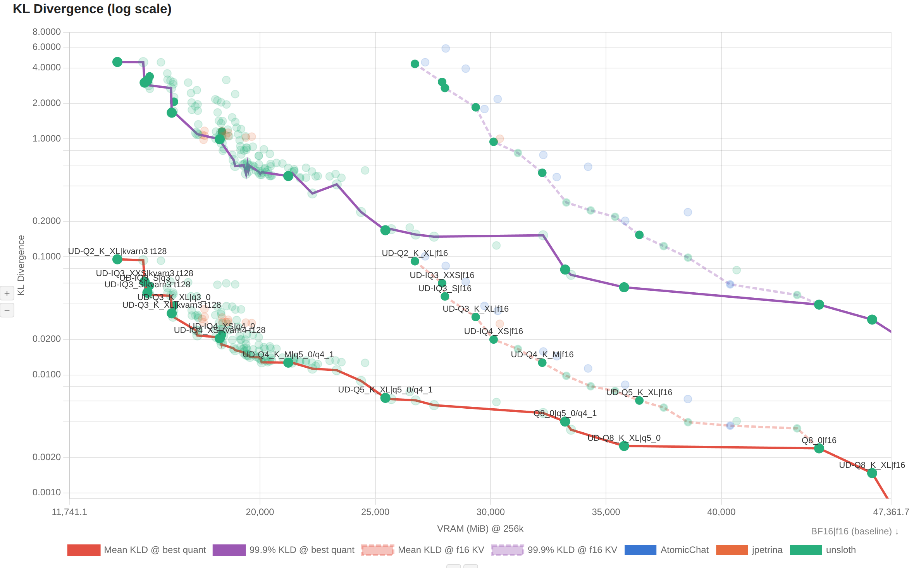
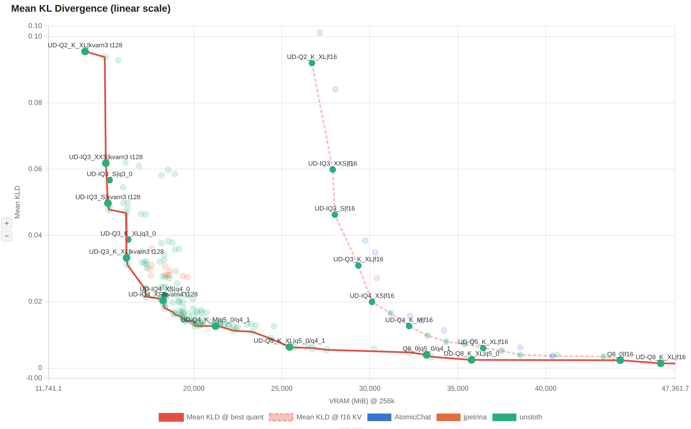
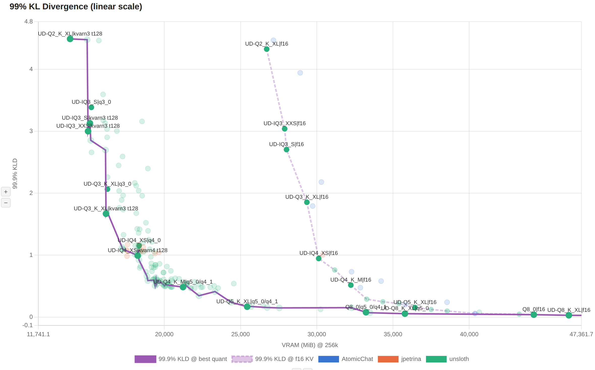
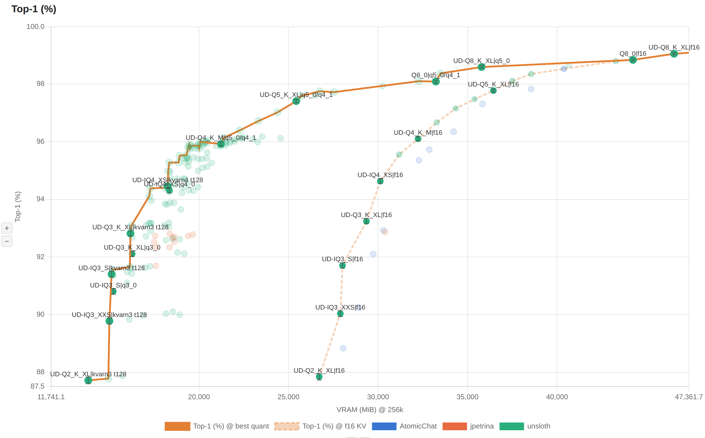
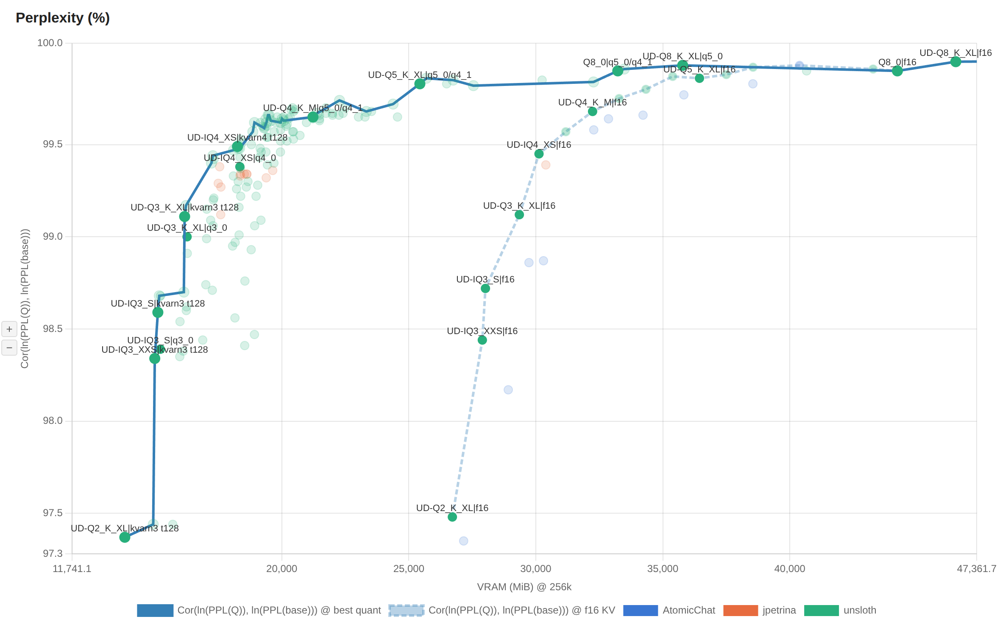
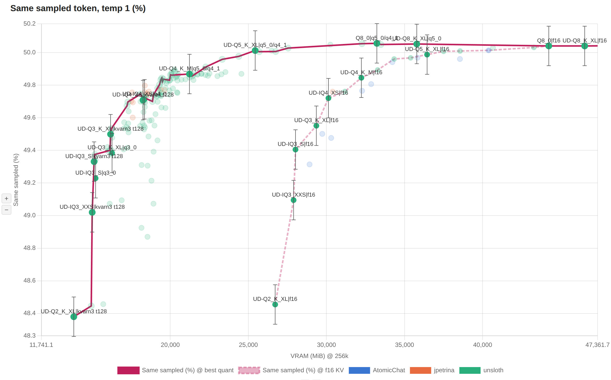
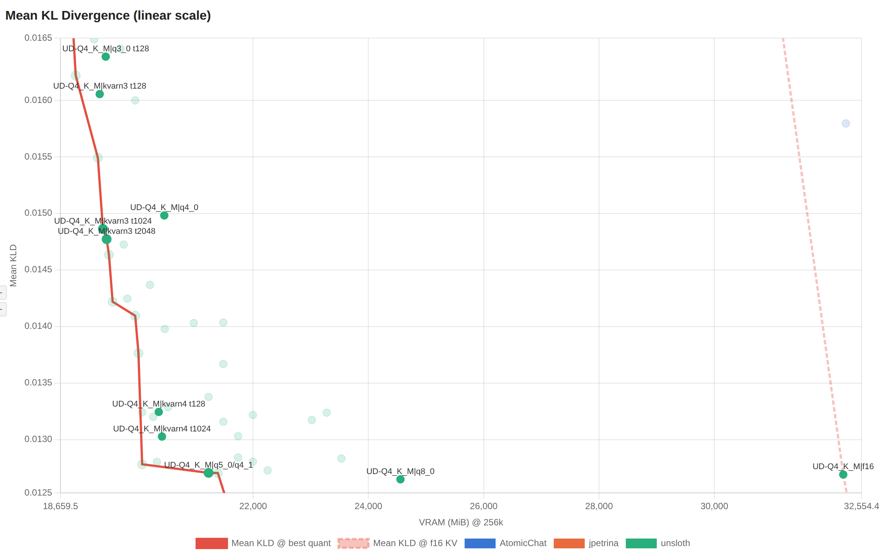
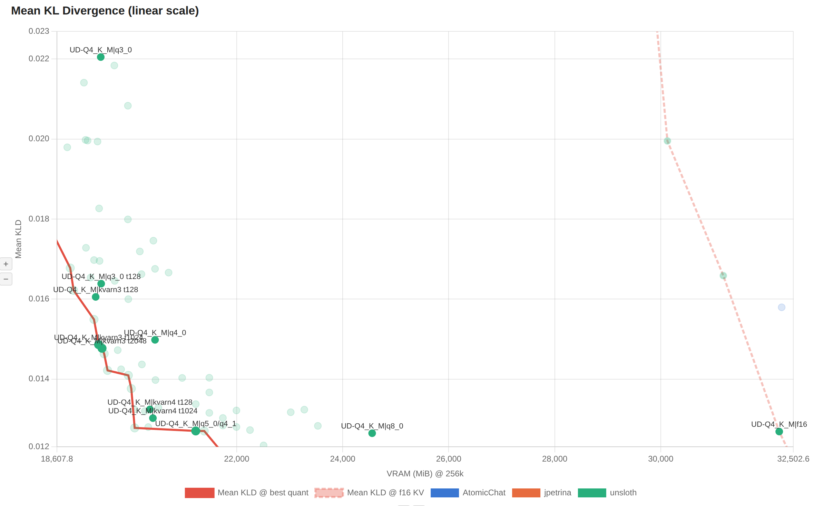
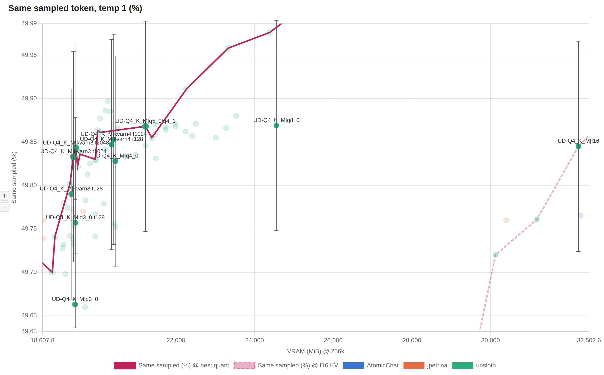

# WIP

WIP

Interactive HTML report:
[perplexity/Qwen3.8-27B/report.html](https://htmlpreview.github.io/?https://raw.githubusercontent.com/crusaderky/pixi-llm-recipes/main/perplexity/Qwen3.8-27B/report.html)

1. KL divergence per chunk (log scale).

   

2. Mean KL divergence vs cost.

   

3. 99% KL divergence vs cost.

   

4. Top-1 match rate.

   

5. Perplexity.

   

6. Same sampled token rate (temp 1).

   

7. Per-KV-cache-layer KL divergence (zoomed in).

   

8. Per-KV-cache-layer KL divergence (zoomed out).

   

9. Per-KV-cache-layer same sampled token rate.

   

## Configuration presets

Here are four ini files for llamacpp, to run Qwen3.8-27B on 32GB to 16GB
VRAM. Serve with `llama-server --models-preset models.ini`.

### 32GB VRAM or 64GB unified RAM

No compromises. Expect zero quality degradation from bf16 weights/f16 KV cache in any
real-world use case (50.0±0.1% → 50.0±0.1% Same Sampled Token, 0.006 mean KLD).
Vision tower on GPU; up to 4 parallel sessions.

**28608 MiB** on CUDA, which leaves plenty of space for desktop.

```ini
version = 1

[Qwen3.8-27B]
hf = unsloth/Qwen3.8-27B-GGUF:Q5_K_XL
ngl = 99
jinja = true

ctx-size = 262144
cache-type-k = q5_0
cache-type-v = q4_1
flash-attn = on
kv-unified = true

# MTP drafter
spec-type = draft-mtp
spec-draft-ngl = 99
spec-draft-n-max = 3

# Thinking mode
temperature = 1.0
top-p = 0.95
top-k = 20
min-p = 0.0
presence-penalty = 0.0
repeat-penalty = 1.0
```

### 24GB VRAM or 32GB unified RAM

Mild quality degradation, unlikely to be detectable in benchmarks and real-life workloads
(50.0±0.1% → 49.7±0.1% Same Sampled Token, 0.021 mean KLD).

**20278 MiB** on CUDA, which leaves plenty of headroom for the desktop.

Vision tower on CPU; parallelism limited to 1. You can move the vision tower to GPU
and/or increase parallelism at the expense of available VRAM for your desktop
applications.

```ini
version = 1

[Qwen3.8-27B]
hf = unsloth/Qwen3.8-27B-GGUF:UD-IQ4_XS
ngl = 99
jinja = true
image-min-tokens = 1024  # Suppress Qwen-specific warning

no-mmproj-offload = true  # Keep vision tower in host memory (-1184 MiB VRAM)
# no-mmproj = true  # Disable vision entirely (to save unified RAM)
parallel = 1  # Only one parallel session, down from 4 (-1632 MiB VRAM)

ctx-size = 262144
cache-type-k = kvarn4  # q4_0 if not using Beellama
cache-type-v = kvarn4  # q4_0 if not using Beellama
flash-attn = on
kv-unified = true

# MTP drafter
spec-type = draft-mtp
spec-draft-ngl = 99
spec-draft-n-max = 3

# Thinking mode
temperature = 1.0
top-p = 0.95
top-k = 20
min-p = 0.0
presence-penalty = 0.0
repeat-penalty = 1.0
```

### 16GB VRAM

Mild quality degradation (same as in the 24 GB setup above), unlikely to be detectable
in benchmarks and real-life workloads.

**15760 MiB** on CUDA. Half context size, no MTP drafter, vision tower offloaded to
CPU, parallelism limited to 1. You *may* have room for an empty desktop on top of it,
but not to open any applications beyond a terminal. If you want to meaningfully use the
PC, move the desktop to the iGPU (if you have one) or to a $50 discrete video card.

```ini
version = 1

[Qwen3.8-27B]
hf = unsloth/Qwen3.8-27B-GGUF:UD-IQ4_XS
no-mmproj = true
ngl = 99
jinja = true
image-min-tokens = 1024  # Suppress Qwen-specific warning

no-mmproj-offload = true  # Keep vision tower in host memory (-1184 MiB VRAM)
# no-mmproj = true  # Disable vision entirely (to save unified RAM)
parallel = 1  # Only one parallel session, down from 4 (-1632 MiB VRAM)

ctx-size = 131072
cache-type-k = kvarn4  # q4_0 if not using Beellama
cache-type-v = kvarn4  # q4_0 if not using Beellama
flash-attn = on
kv-unified = true

# Thinking mode
temperature = 1.0
top-p = 0.95
top-k = 20
min-p = 0.0
presence-penalty = 0.0
repeat-penalty = 1.0
```

### Absolute minimum

**13142 MiB** on CUDA, Beellama only. Half context size, no MTP drafter, vision tower
offloaded to CPU, parallelism limited to 1. On a 16GB video card, this leaves enough
room for desktop, *or* to increase context size, *or* to enable the MTP drafter, *or* to
move the vision tower to GPU (pick one).

**Beware:** you're threading uncharted waters here. In the absolute best case, you will
experience modest additional degradation compared to the previous configuration
(49.7±0.1% → 49.3±0.1% Same Sampled Token). In the worst case, quality will fall off
a cliff (0.021 → 0.057 mean KLD). For quality to remain acceptable, two untested
assumptions must hold true:

- The Same Sampled Token measure shows that you're still above the edge of the quality
  cliff; however KLD shows that you've already fallen off. Only one of the two measures
  can be right. We haven't gathered test evidence yet about which measure is right.
- kvarn3 shows a substantial uplift compared to q3_0/q3_0, but that's mostly thanks to
  its exact tail that is 128 tokens long. It's not been tested yet how much the uplift
  in KLD holds up in actual benchmarks that rely on precise recollection beyond the
  latest paragraph.

```ini
version = 1

[Qwen3.8-27B]
hf = unsloth/Qwen3.8-27B-GGUF:UD-IQ3_S
no-mmproj = true
ngl = 99
jinja = true
image-min-tokens = 1024  # Suppress Qwen-specific warning

no-mmproj-offload = true  # Keep vision tower in host memory (-1184 MiB VRAM)
parallel = 1  # Only one parallel session, down from 4 (-1632 MiB VRAM)

ctx-size = 131072  # Can increase to 262144 (+1854 MiB VRAM)
cache-type-k = kvarn3
cache-type-v = kvarn3
flash-attn = on
kv-unified = true

# MTP drafter (+1508 MiB VRAM)
# spec-type = draft-mtp
# spec-draft-ngl = 99
# spec-draft-n-max = 3

# Thinking mode
temperature = 1.0
top-p = 0.95
top-k = 20
min-p = 0.0
presence-penalty = 0.0
repeat-penalty = 1.0
```
